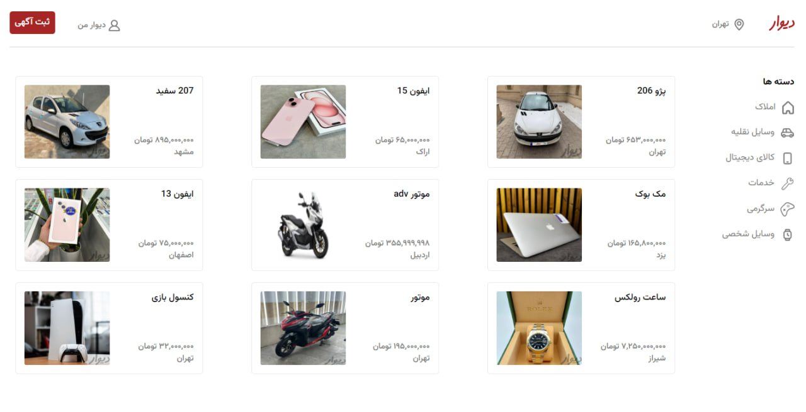
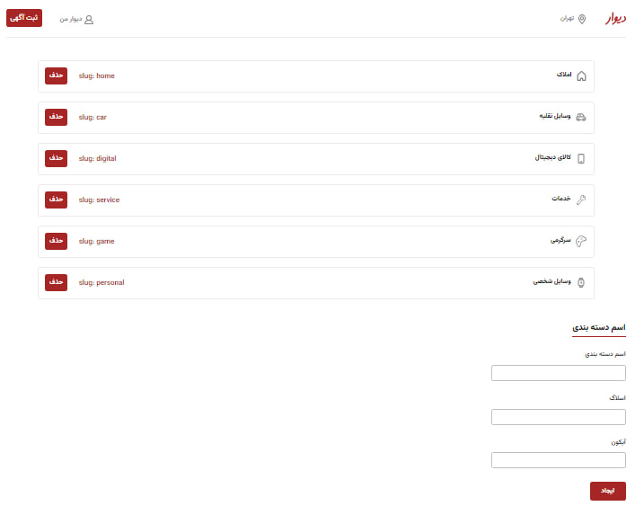
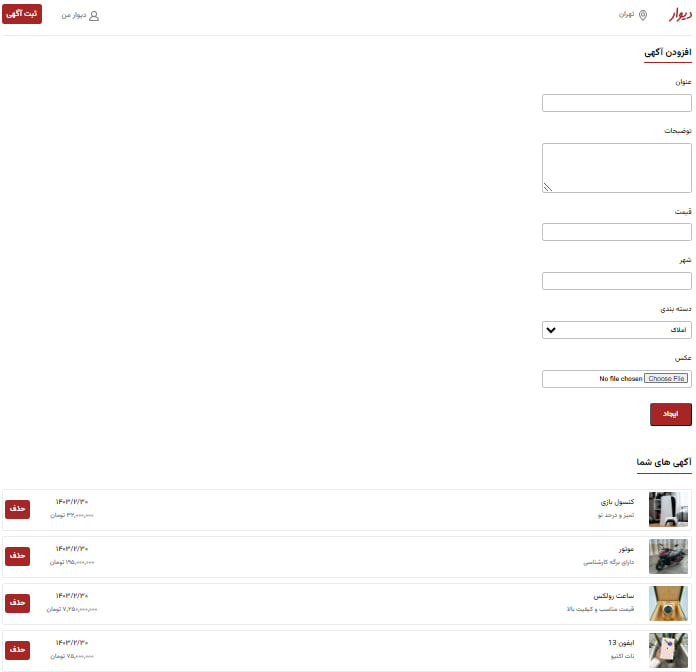
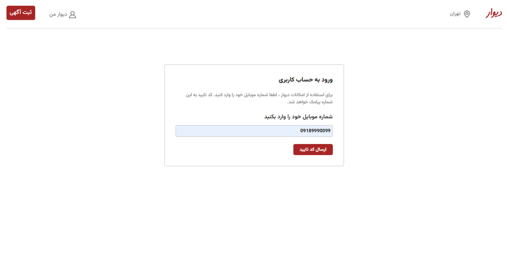
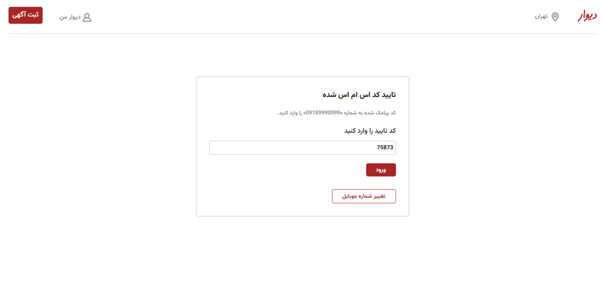

# Divar Project

---

## Features

- Authorization and Authentication system using Access Token and Refresh Token

- The admin panel and the possibility of adding and removing site options through this panel with the address "/auth"

- Users can log in by entering their mobile number

- The verification code for the user's mobile number is visible and validated in the backend to ensure the authenticity of the mobile number.

- Users can upload photos when posting ads

- Each user can view the posts they have previously registered with the same phone number and has the ability to delete their posts.

---

## Backend

This project uses a pre-prepared backend for handling mobile number verification and other server-side functionalities

### Installation backend

1. Clone the backend repository from GitHub:

   ```sh
   git clone https://github.com/Ghalami/rjs-divar-api
   ```

2. Navigate to the project directory:

   ```sh
   cd rjs-divar-api
   ```

3. Install dependencies:

   ```sh
   npm install
   ```

4. Start the server:
   ```sh
   npm start
   ```

## Usage

1. To log into the site, enter your mobile number. The verification code is available in the prepared backend.
2. If you log in with the mobile number `09189990099`, you will have access to the admin panel.

---

### Home Page



### Admin Page



### Dashboard Page



### Login Page



